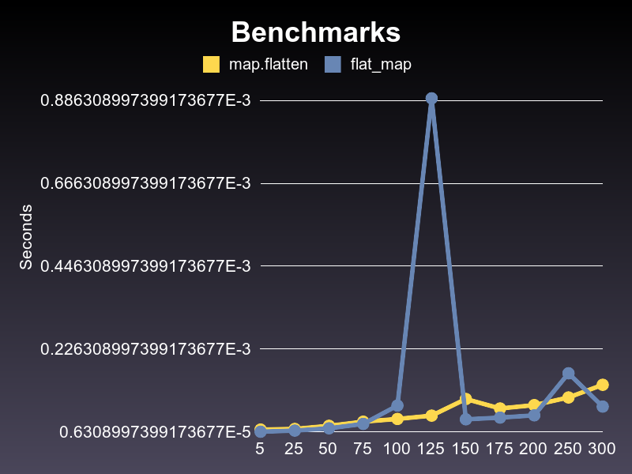

# benchmark-plot

A Ruby benchmark extension to allow comparative plotting of benchmarks.

# Usage

This gem is mainly useful for benchmarking code over a number of inputs. This input should be supplied in the form of an object capable of calling `#each`.

Sample benchmarking script:

``` ruby
require 'benchmark/plot'

class TestArray
  attr_reader :arr

  def initialize arr
    @arr = arr
  end

  def to_s
    @arr.size.to_s
  end
end

test_data = [5, 25, 50, 75, 100, 125, 150, 175, 200,250,300]
test_data.map! {|e| TestArray.new(Array.new(e) {|i| i}) }

Benchmark.plot(test_data) do |x|
  x.report("map.flatten") do |data|
    data.arr.map { [nil]  }.flatten
  end

  x.report("flat_map") do |data|
    data.arr.flat_map { [nil] }
  end
end
```

Output:



# Acknowledgements

[@tgxworld](https://github.com/tgxworld) for providing the co-working space during the Open Source Breakfast Hack during Red Dot Ruby Conference 2016 where this gem was built.
